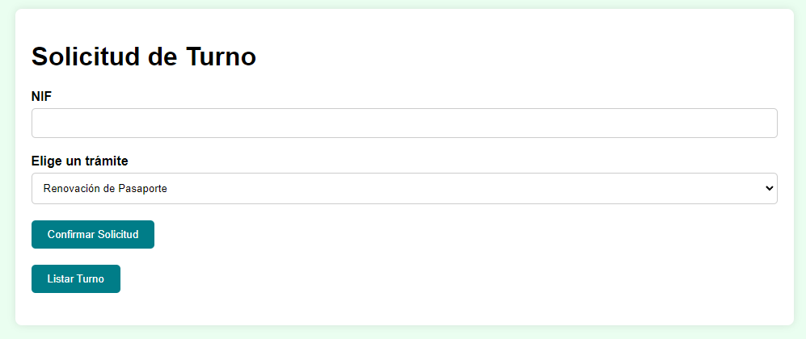
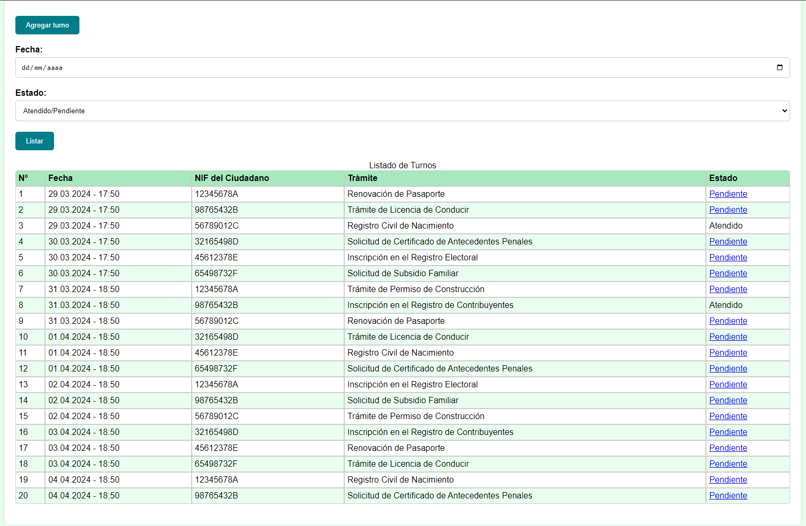

# PRUEBA TÉCNICA 2
Hack A Boss - Softtek

Aaron Manuel Fernández Mourelle

## DESCRIPCIÓN
Aplicación encargada de operaciones de gestión sobre un turnero, guardando la información en una base de datos MySQL.

## ⚙️FUNCIONALIDADES
### ➕ALTA DE TURNO
Se realizará un alta para el ciudadano registrando únicamente el DNI de éste y el tipo de trámite que vino a realizar. Posteriormente se abrirá el listado de turnos para informar al ciudadano de su turno y la situación general del turnero.

### 📑LISTADO
Se muestra un listado de turnos ordenados por fecha de registro. Este listado podrá filtrarse por fecha (obligatoriamente) y estado del turno (pendiente, atendido o indistinto). Si hacemos click en el botón sin proporcionar una fecha, se mostrará todo el listado de nuevo.

## 📝USO
### Ejecución de la aplicación
#### 🔧Requisitos
- IDE que soporte Java. Se recomienda el uso de NetBeans por su soporte a JSP.
- Apache Maven.
- Xampp, wamp, o cualquier otro gestor (incluído nativo) que de soporte a MySQL (puerto por defecto 3306).
- Base de datos de nombre `Turnero`.
- Ejecutar el script `dump_Turnero.sql` para generar las tablas, cargar trámites y datos de ejemplo.

#### ⏯️Ejecución
Para lanzar la aplicación, clone este repositorio y abra el proyecto con su IDE preferido.
Se recomienda ejecutar el proyecto en un servidor local, como Apache Tomcat, para poder visualizar la aplicación en un navegador web.

Al abrir la aplicación, se entrará directamente al formulario de alta de turno.

Y pulsando sobre Listar Turnos, se accede a dicho listado.

### 🔍Validación de datos
Se validará el DNI de ciudadano con un formato simplificado, únicamente para evitar la manipulación del html. Como solo se podrá ignorar el patrón si el usuario manipula el html, no se dará información al posible atacante.

## 💭SUPUESTOS
- Se asume que la fecha de registro de un turno es la fecha en la que se realiza el alta del mismo.
- Se asume que quien maneja la aplicación es un empleado, no directamente el ciudadano. Por ello, se puede realizar una actualización de estado sin necesidad de autenticación.